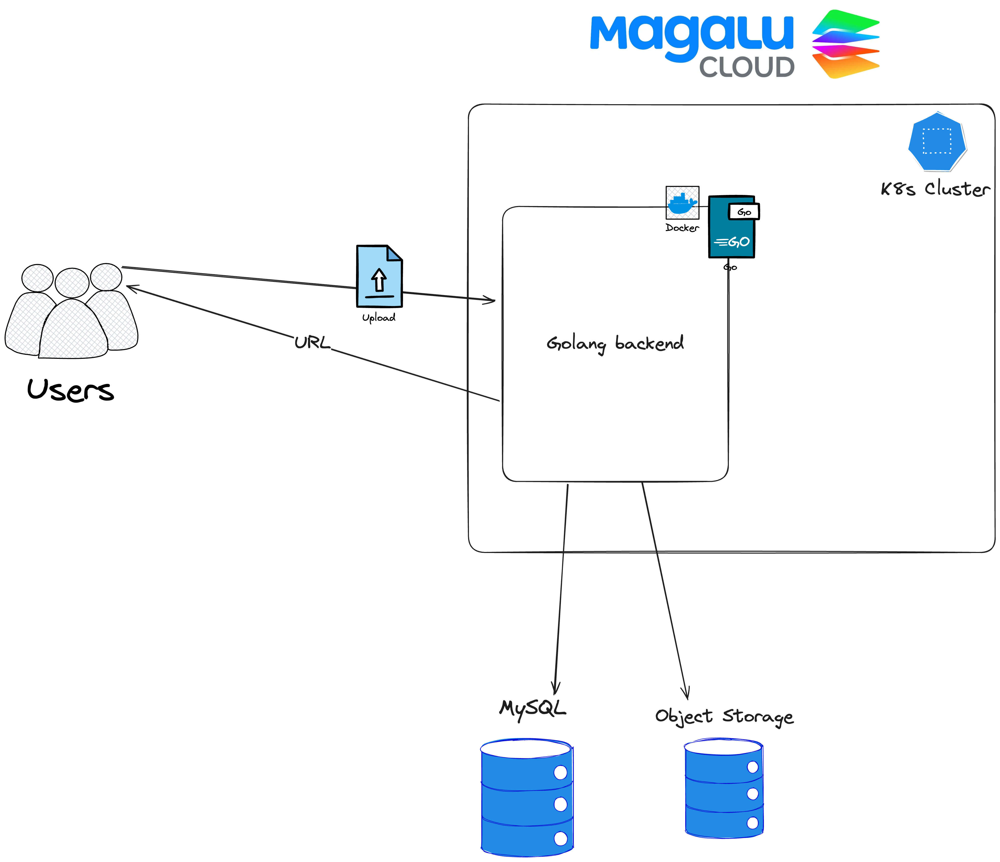

# quack-lu

Magalu Cloud + Golang. Poderia ser melhor?

# Introdução

Esse projeto pertence a uma série de aulas, entre uma parceria firmada entre nós dos Patos.dev e a [MagaluCloud](https://magalu.cloud/). O objetivo principal é mostrar para os membros do Patos.dev como usar os serviços da Magalu Cloud para tornar suas aplicações mais escaláveis e seguras reproduzindo um cenário real de uma aplicação.

# Principais conceitos

Durante as aulas, vamos cobrir alguns conceitos importantes, como:

- Subir e gerenciar componentes de infraestrutura na Magalu Cloud usando Terraform;
- Subir um cluster de kubernetes que vai rodar nossa aplicação;
- Criar uma aplicação em Golang que vai ser integrada com um banco de dados Mysql/Blob Storage e subi-la em um cluster de kubernetes.
- Documentação da aplicação usando OpenAPI;

# A aplicação

Nos queremos construir um sistema de compartilhamentos de arquivos distribuído. A ideia é que usuários possam fazer upload de arquivos e imagens e compartilhar com seus amigos do patos.dev.

# Enpoints e estrutura da aplicação

A aplicação terá os seguintes endpoints:

- `POST /upload`: Endpoint para upload de arquivos;
- `GET /files/{file_id}`: Endpoint para visualização de arquivos compartilhados;
- `POST /files/{file_id}/share`: Endpoint para gerar links de compartilhamento de arquivos;

# Arquitetura

